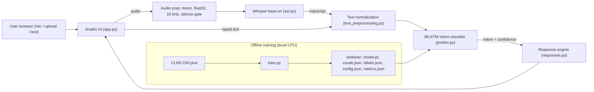

# ARCHITECTURE — Voice-Enabled Intent Chatbot

## 1. Diagram



## 2. Components

| Component | File | Responsibility |
|-----------|------|----------------|
| Config | `src/config.py` | Paths, hyperparameters, seeds, threshold default |
| Data | `src/data.py` | Load CLINC150 plus, label maps, split stats |
| Preprocessing | `src/text_preprocessing.py` | `normalize_text`, `tokenize`, `Vocab` (encode/pad, save/load) |
| Model | `src/model.py` | `BiLSTMClassifier` |
| Training | `src/train.py` | Train loop, early stopping, threshold tuning, save artifacts |
| Evaluation | `src/evaluate.py` | Metrics on test split → `metrics.json` |
| ASR | `src/asr.py` | `SpeechRecognizer`: audio prep, silence gate, Whisper transcription |
| Predictor | `src/predict.py` | `IntentPredictor`: loads artifacts, returns top-k intents + probs |
| Responses | `src/responses.py` | `ResponseEngine`: intent → response, dynamic handlers, fallback |
| Pipeline | `src/pipeline.py` | `VoiceChatbot`: audio/text → result dict |
| UI | `app.py` | Gradio Blocks interface; loads models once at startup |

## 3. Data flow (one request)

1. Gradio returns `(sample_rate, np.ndarray)` for mic/upload.
2. Audio prep: stereo → mono, int16 → float32 in [-1, 1], resample to 16 kHz (librosa). If duration < 0.5 s or RMS below threshold → return "I didn't catch that."
3. Whisper `base.en` → transcript.
4. `normalize_text`: lowercase, keep `[a-z0-9']`, collapse spaces (same function used in training).
5. Tokenize → ids (`<unk>` for OOV) → pad/truncate to 32.
6. BiLSTM → softmax over 151 classes.
7. If top class is `oos` or prob < threshold → fallback response; else template response (or dynamic handler).
8. UI shows transcript, intent, confidence, response; appends to history.

## 4. Model pipeline

**Dataset:** CLINC150 "plus" — 150 intents in 10 domains + `oos`; train 15,250 / val 3,100 / test 5,500.

**Architecture:**
```
token ids (B, 32)
 → Embedding(V, 128, padding_idx=0)
 → BiLSTM(hidden=128, 1 layer, bidirectional) → (B, 32, 256)
 → masked max-pool over time → (B, 256)
 → Dropout(0.3) → Linear(256, 151) → logits
```

**Training:** Adam lr 1e-3, batch 64, cross-entropy, ≤ 15 epochs, early stopping (patience 3) on val accuracy, seed 42. Vocab from train split, `min_freq=2` so the model learns `<unk>`.

**Threshold:** chosen on the validation split to maximize overall accuracy when predictions below the threshold are relabelled `oos`.

**Metrics:** in-scope accuracy, OOS recall, overall accuracy, macro-F1 (test split).

## 5. Deployment architecture

- Hugging Face Space, SDK = Gradio, free CPU tier, public.
- Runtime deps only in `requirements.txt` (CPU-only torch via extra index URL). Training deps in `requirements-train.txt` (not installed on the Space).
- Artifacts committed to the repo (< 10 MB). Whisper weights are downloaded from the HF Hub on first start and cached.
- Space `README.md` carries the YAML header (sdk, sdk_version, app_file, python_version).
- Served over HTTPS, which browsers require for microphone access.

## 6. Technology rationale

| Choice | Why | Rejected alternatives |
|--------|-----|-----------------------|
| Whisper base.en (server) | No key, robust to accents, explainable transformer, fast enough on CPU | Web Speech API (browser-specific, black box), SpeechRecognition lib (unofficial Google endpoint), cloud STT (keys) |
| BiLSTM from scratch | Clearly deep learning, trains in minutes on CPU, tiny artifact, easy to explain | TF-IDF+MLP (weak DL claim), DistilBERT (GPU + large artifact; stretch only) |
| Template responses | Deterministic, always appropriate, testable | Neural generation (incoherent), LLM API (key, not your model) |
| Gradio | Native mic component, one file, native to Spaces | Streamlit (RAM limits on its cloud), Flask + JS (2× effort) |
| HF Spaces | Free, enough RAM for torch + Whisper, HTTPS, git deploy | Streamlit Cloud (RAM cap), Render free (512 MB) |
